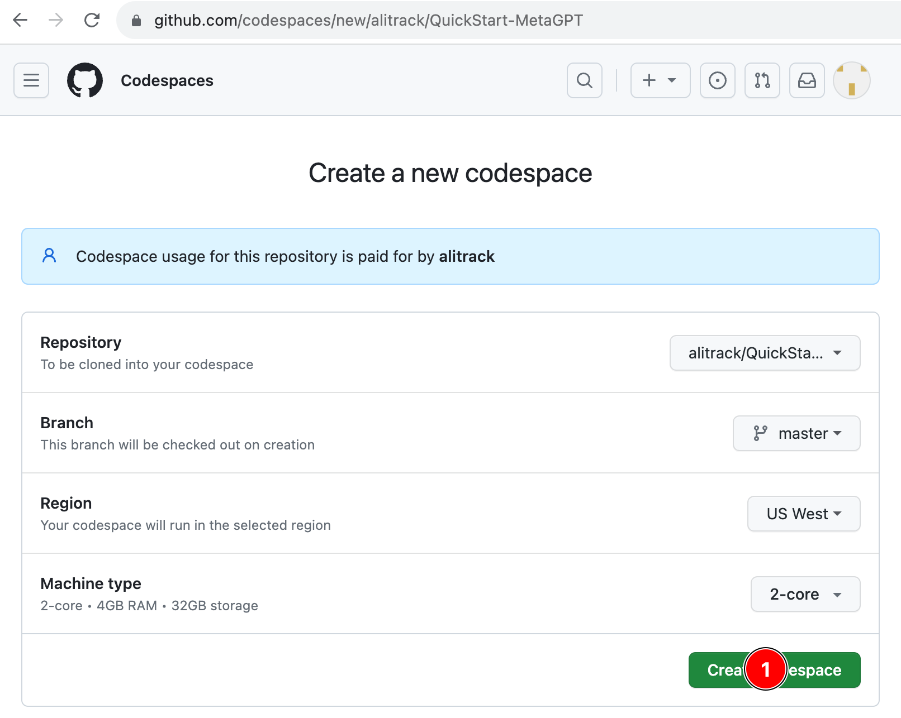
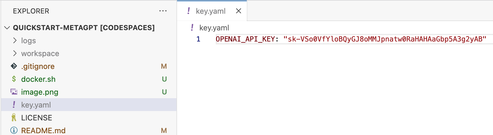
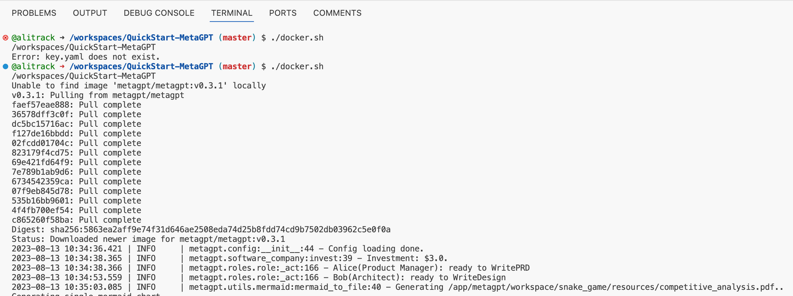

# MetaGPT QuickStart

## Prerequisites
- GitHub Account
- OpenAI Key

## Quick Start with GitHub Codespaces

1. Create a [GitHub Codespaces](https://codespaces.new/alitrack/QuickStart-MetaGPT)

2. create a `key.yaml` file at least with  `OPENAI_API_KEY`

3. run `./docker.sh` version quick start

4. download workspace.zip
